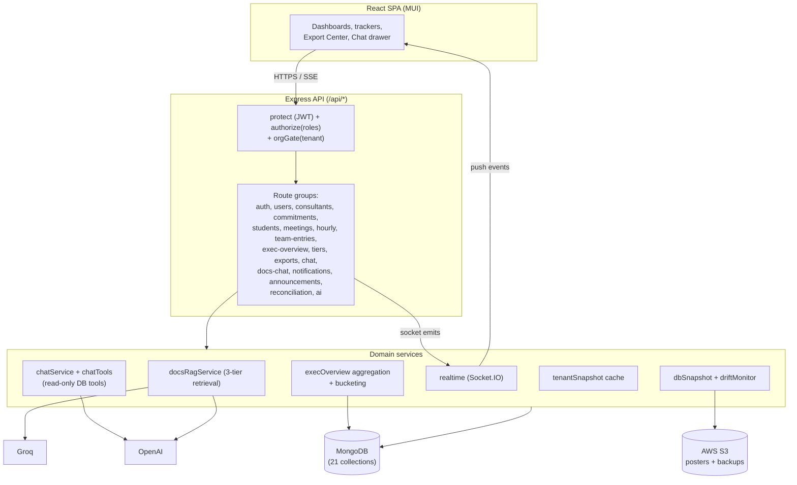
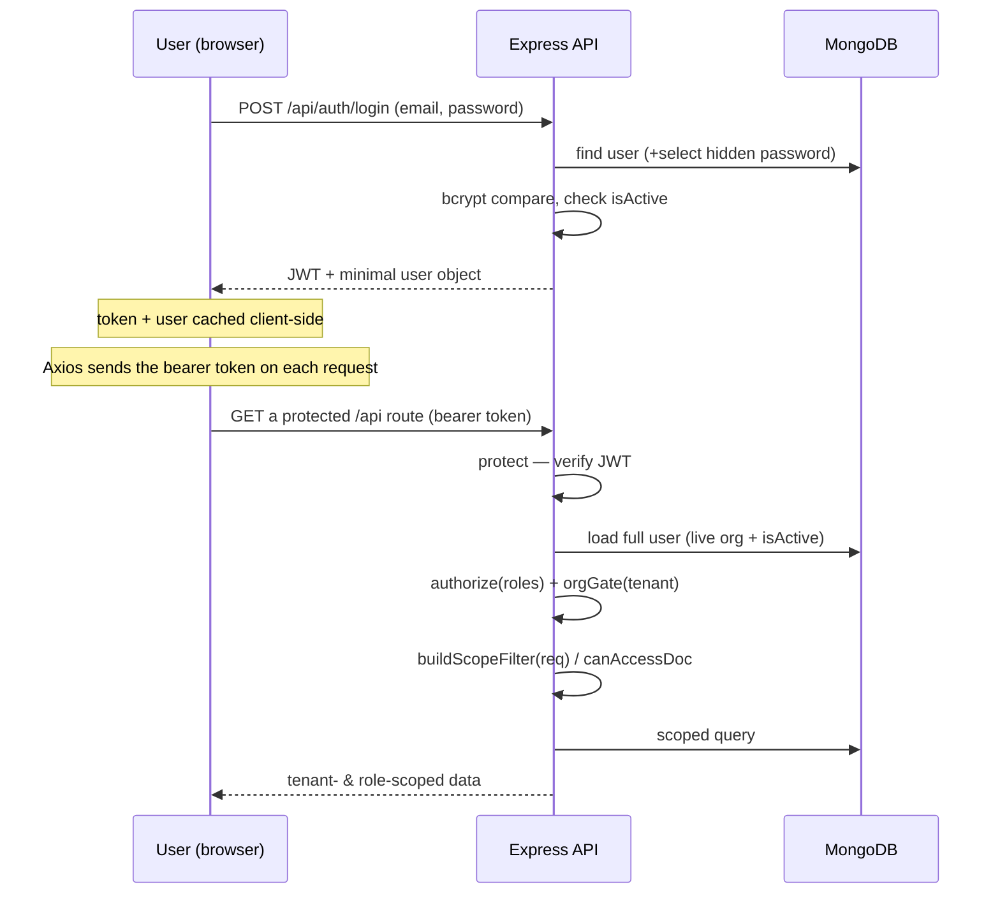
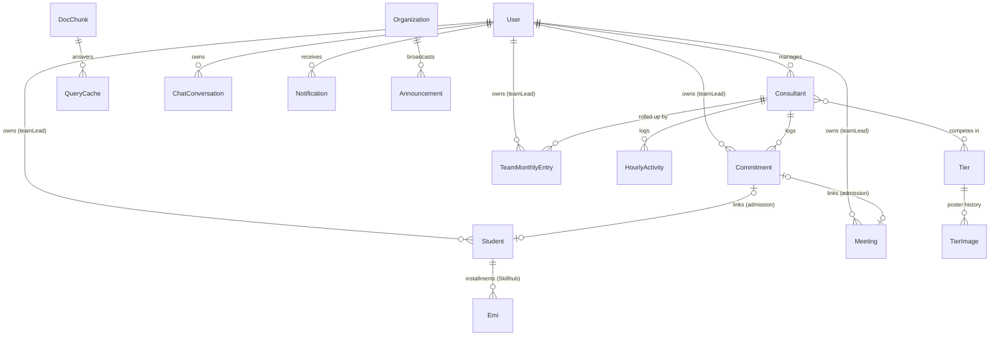
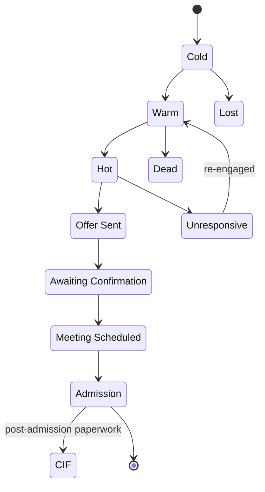
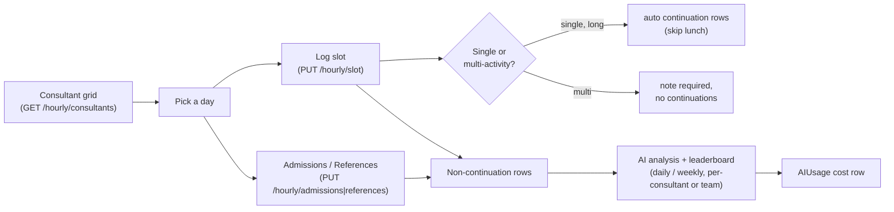
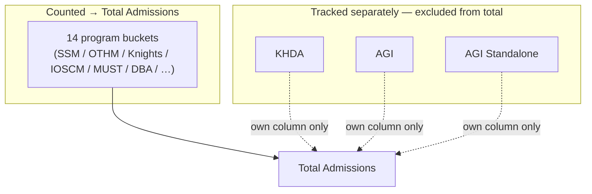
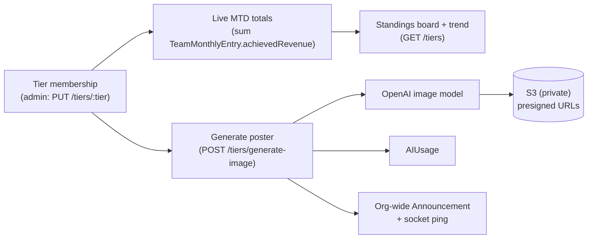
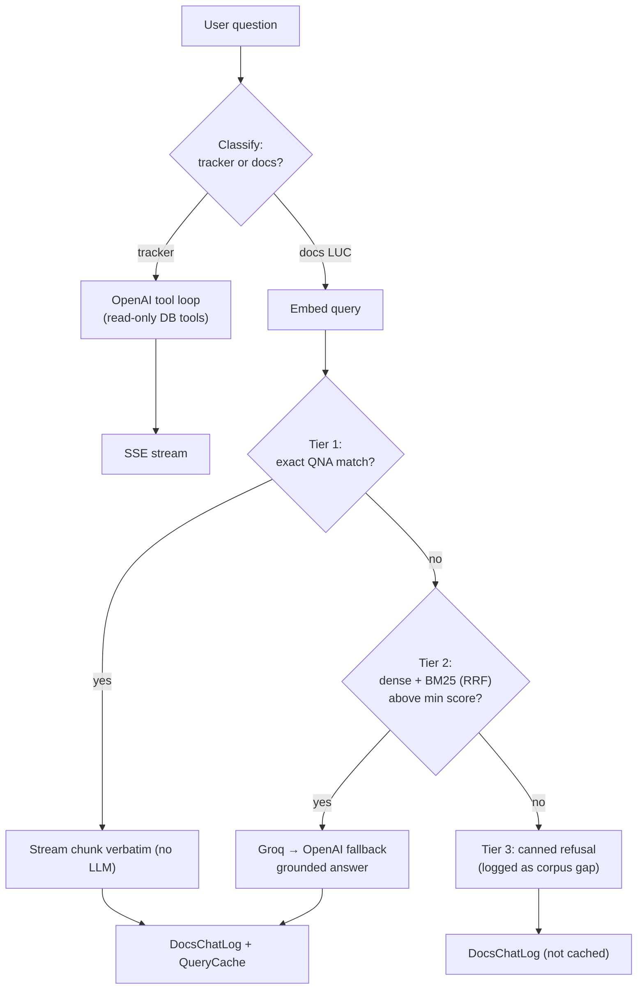
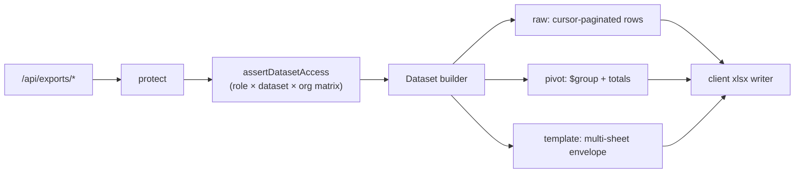
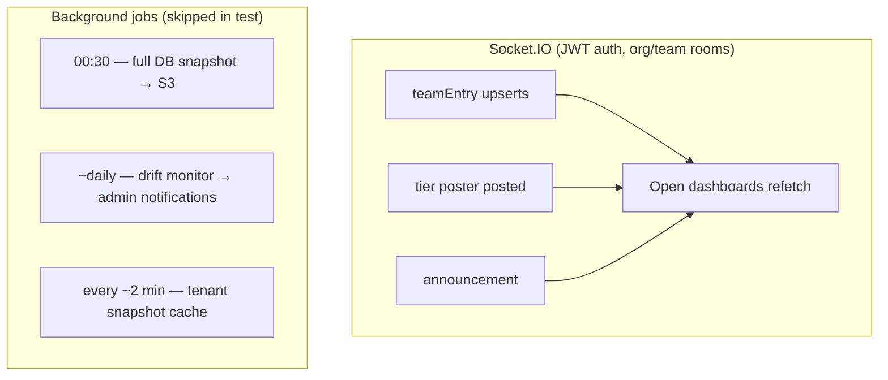

# Team Progress Tracker

A multi-tenant MERN application for running a sales-and-admissions organisation end to end:
it captures the weekly sales pipeline, admitted/enrolled students, meetings, hour-by-hour
consultant activity, a manually-maintained leadership reporting layer, a month-end
gamified race, an in-app AI copilot + grounded program-docs assistant, a self-serve export
centre, and the platform plumbing (notifications, announcements, reconciliation, AI-cost
accounting, realtime sync, and nightly backups) that keeps it all consistent.

> **Privacy note.** This document describes *architecture and data shapes only*. It contains
> no credentials, secrets, connection strings, personal data, or live records. Field names
> describe schema, never values.

---

## Table of contents

- [What it is](#what-it-is)
- [Tech stack](#tech-stack)
- [High-level architecture](#high-level-architecture)
- [Tenancy & roles](#tenancy--roles)
- [Authentication & request scoping](#authentication--request-scoping)
- [Data model](#data-model)
- [Feature modules — what the tracker captures](#feature-modules--what-the-tracker-captures)
  - [1. Consultants & Commitments](#1-consultants--commitments-weekly-sales-tracking)
  - [2. Students (admissions)](#2-students-admissions)
  - [3. Meetings tracker](#3-meetings-tracker)
  - [4. Hourly Activity Tracker](#4-hourly-activity-tracker)
  - [5. Leadership Dashboard & Executive Overview](#5-leadership-dashboard--executive-overview)
  - [6. Tier Fight (month-end race)](#6-tier-fight-month-end-race)
  - [7. "Ask me" chat + Program-Docs RAG](#7-ask-me-chat--program-docs-rag)
  - [8. Export Center](#8-export-center)
  - [9. Platform services](#9-platform-services)
- [Realtime & scheduled jobs](#realtime--scheduled-jobs)
- [API surface](#api-surface)
- [Project structure](#project-structure)
- [Getting started](#getting-started)
- [Environment variables](#environment-variables)
- [Security posture](#security-posture)
- [Deployment](#deployment)

---

## What it is

The tracker serves a sales/admissions business with two tenants under one deployment:

- **Higher-education enrolments** (the original organisation, multiple sales teams led by team leads).
- **A coaching institute** with two branches (training + institute) handling school-curriculum admissions.

Four user roles collaborate across these tenants. Everything a consultant or counsellor does —
the leads they commit to each week, the meetings they run, the students they admit, the hours
they log — is captured, scoped to the right tenant/team, and rolled up into dashboards, an AI
copilot, and exportable reports.

---

## Tech stack

| Layer | Technology |
|---|---|
| Frontend | React 19, Material-UI v7, React Router v7, Recharts + Apache ECharts, Axios, `xlsx` + `file-saver`, `date-fns` |
| Backend | Node.js, Express 5, Mongoose 9 (CommonJS) |
| Database | MongoDB (Atlas in production) |
| Realtime | Socket.IO (JWT-authenticated, org/team rooms) |
| Auth | JWT bearer tokens, bcrypt password hashing |
| AI | OpenAI (`gpt-4o-mini` for analysis/chat, image model for posters); Groq as the primary generator for the docs assistant with OpenAI fallback |
| Storage | AWS S3 (poster images + nightly DB snapshots) — optional; degrades gracefully when unconfigured |
| Jobs | `node-cron` (nightly backup), interval-based drift monitor, cached tenant snapshot |
| Security | Helmet, CORS |

Ports in development: **frontend `:3001`**, **backend `:5001`**.

---

## High-level architecture



In production the Express server also serves the compiled React build as static files with an
SPA fallback for any non-`/api` route.

---

## Tenancy & roles

Every tenant-scoped collection carries an `organization` field. The tenant enum is
`luc | skillhub_training | skillhub_institute`.

| Role | Scope | Can write | Notes |
|---|---|---|---|
| **admin** | All tenants (may opt into one via `?organization=`) | Yes (full) | Only role that maintains the leadership dashboard and tier membership |
| **team_lead** | Own tenant, own team (records they own) | Yes (own team) | Can *read* all teams on the Executive Overview; read-only there |
| **manager** | Restricted surface | Limited | Read access to student lists/stats; broader org choice only inside the Export Center |
| **skillhub** | One login per branch; own branch + own records | Yes (own branch) | Branch logins for the coaching institute |

Two reusable concepts enforce isolation everywhere:

- `buildScopeFilter(req)` — turns the caller's role + tenant into a Mongoose filter for list/read queries.
- `canAccessDoc(user, doc)` — the single-document equivalent used on GET/PUT/DELETE.
- `orgGate(tenant)` — locks an entire route group to one tenant (used by LUC-only features).

---

## Authentication & request scoping

There is **no public sign-up** — accounts are created by an admin. Login issues a stateless JWT
(carrying only the user id + role); the tenant and active-status are re-read from the database on
every request, so a token never embeds stale tenant data.



Passwords are bcrypt-hashed (the field is `select:false`), failed logins return a generic message
to avoid account enumeration, and deleting users is a soft delete (`isActive=false`) with a
separate admin-only hard delete that refuses to remove admin accounts.

---

## Data model

The application persists **21 collections**. Core relationships:



| Collection | Purpose |
|---|---|
| `User` | Login accounts; role + tenant + team-lead hierarchy |
| `Consultant` | Sales consultants/counsellors (no login); managed by a team lead/branch |
| `Commitment` | Weekly sales-tracking record per lead (the pipeline) |
| `Student` | Admitted/enrolled student (dual-mode: higher-ed + coaching) |
| `Meeting` | Logged admissions meeting (LUC) |
| `HourlyActivity` | Per-consultant per-day per-slot activity log |
| `DailyAdmission` / `DailyReference` | Per-consultant per-day admission/reference counts |
| `TeamMonthlyEntry` | Manually-entered monthly targets/revenue/bucket counts (leadership source of truth) |
| `Tier` / `TierImage` | Month-end race tiers + generated poster archive |
| `DocChunk` / `QueryCache` / `DocsChatLog` | Program-docs RAG corpus, answer cache, request analytics |
| `ChatConversation` | Unified per-user chat history (tracker + docs) |
| `SavedExportTemplate` | User-saved Pivot Builder configs |
| `Notification` | Per-user in-app bell items |
| `Announcement` | Org-wide dismissable banners |
| `AIUsage` | One row per AI call (tokens + cost accounting) |
| `Counter` | Atomic sequence generator (kept; currently unused) |
| `WeeklySummary` | Legacy aggregated weekly metrics (present, not wired in) |

---

## Feature modules — what the tracker captures

### 1. Consultants & Commitments (weekly sales tracking)

The pipeline core. Team leads/branches register their **Consultants**, then log a **Commitment**
each ISO week per lead: what was committed vs achieved, the lead stage, meetings done, follow-up
notes, conversion probability, and the final admission-closure outcome (date + amount).

What a Commitment captures: the consultant + denormalised team labels, the ISO week
(`weekNumber`/`year`/`weekStartDate`/`weekEndDate`) and the actual `commitmentDate`, the lead/student
details, `commitmentMade` vs `commitmentAchieved`, `meetingsDone`, `leadStage`,
`conversionProbability`, follow-up fields, corrective-action/admin notes, and the
`admissionClosed`/`closedDate`/`closedAmount` close-out. Skillhub commitments may carry up to four
embedded demo slots.

Key rules:

- **Admission closure is irreversible** — once closed it cannot be reopened.
- Reaching lead stage *Admission* with *achieved* status **auto-closes** the commitment.
- `commitmentDate` must fall inside the committed week for team leads (admins/branch logins may back-date).
- Closed LUC admissions can be **linked to a Student record** so the two sources stay consistent.
- An OpenAI-backed endpoint summarises the pipeline in the current filter window.



> Lead stages (shared with the Meetings tracker): Dead, Cold, Warm, Hot, Offer Sent,
> Awaiting Confirmation, Meeting Scheduled, Admission, CIF, Unresponsive, No Answer, Lost.

### 2. Students (admissions)

One dual-mode schema serves both tenants. Higher-ed fields (`program`, `university`, `source`,
`campaignName`, fees, company/professional fields, …) are required only for that tenant; coaching
fields (`enrollmentNumber`, `curriculum`, `academicYear`, `yearOrGrade`, `subjects`, `mode`,
`courseDuration`, EMIs, three-party parent contacts, …) are required only for the institute.

Captured: identity + contact blocks, academic/program info, fee & **EMI installment** tracking,
lead-source attribution, counsellor/team assignment, and (for higher-ed) a back-link to the
**Commitment** that produced the admission. `outstandingAmount` is a derived virtual
(`courseFee − admissionFeePaid − registrationFee − Σ EMI paid`).

Key rules:

- Serial numbers (`sno`) auto-increment per team (higher-ed) or per tenant (coaching).
- Higher-ed creates must link an unlinked Commitment **or** be flagged manual-entry with a reason.
- Server-side validation rejects future/illogical dates and total-paid exceeding the course fee.
- A documented importer artefact (higher-ed rows with zero admission fee) is **hidden** from every
  list/stats query at the controller layer (rows stay in the DB).
- Coaching students move through `new_admission → active → inactive` status transitions.
- The stats endpoint re-derives EMI/outstanding figures inside the aggregation (virtuals don't survive `.lean()`).

### 3. Meetings tracker

A LUC-only log of admissions meetings: who met which prospective student, in what `mode`, on what
`meetingDate`, the resulting lead stage, optional co-attendees, and remarks. It is the meeting-stage
mirror of the commitment tracker — an *Admission*-status meeting must link to a closed commitment or
be explicitly flagged manual (with a reason) so the two trackers can't drift apart. Offers table /
board / cards views, a KPI strip, filters, and an on-demand AI summary.

### 4. Hourly Activity Tracker

A daily productivity grid: each consultant/counsellor records what they did in fixed time slots
(~9:30–19:30), plus per-day **admission** and **reference** counts. Each tenant has its own slot
layout and activity vocabulary; long activities auto-spawn "continuation" rows across later slots
(skipping the lunch gap). AI-generated daily/weekly **leaderboards** and performance analysis sit on
top, tuned per tenant.



Notable rules: non-admins can only write **today**; certain LUC activity types lock once saved;
team-lead "self-consultant" rows are excluded from the grid, analysis, and leaderboards; the viewed
tenant is resolved authoritatively from the consultant record.

### 5. Leadership Dashboard & Executive Overview

A LUC-only reporting layer that replicates a leadership Excel workbook as a live dashboard. The
**single source of truth is manual entry** (`TeamMonthlyEntry`, one row per consultant × month);
every rollup — Total Admissions, % revenue, team totals, MTD/YTD strips, consultant rankings, and
program-by-month matrices — is computed on read, not derived from raw student records. Admins
maintain the data; team leads read every team but cannot edit.

Program admissions are grouped into **buckets**. 14 *program* buckets sum into **Total Admissions**;
**KHDA** and the two **AGI** buckets are tracked in their own columns but **never** added to the
total (displayed KHDA-before-AGI):



A Socket.IO layer broadcasts thin change events (ids + year/month) so every open dashboard refetches;
when an admin's edit increases a bucket count, a best-effort org-wide "new admission" announcement is
raised.

### 6. Tier Fight (month-end race)

A LUC-only motivational competition: consultants are grouped into three admin-managed **tiers** and
raced on month-to-date achieved revenue (summed live from `TeamMonthlyEntry`, never stored on the
tier). Admins can generate AI **poster images** that bake in live standings, archive them to S3, log
the image cost to the AI-usage dashboard, emit a realtime ping, and raise a dismissable org-wide
banner. Team leads view standings and posters read-only.



### 7. "Ask me" chat + Program-Docs RAG

One chat drawer, two backends, routed per-turn by a client-side classifier (with an LLM tiebreaker
that safely defaults to the tracker path):

- **Tracker chat** (`POST /api/chat/stream`) — an OpenAI tool-calling agent that answers analytics
  questions over the live database using **read-only** tools (commitment stats, revenue, leaderboards,
  attendance, students, people search), streamed over SSE. Available to any authenticated user;
  currency is always AED; prompt-injection/exfiltration defenses and a scope-clarification protocol
  are built in.
- **Docs RAG** (`POST /api/docs-chat`, LUC-only) — a grounded assistant over pre-ingested program
  PDFs using a three-tier retrieval pipeline, generated by Groq (OpenAI fallback chosen before any
  bytes stream), with answer caching and per-request analytics.



Both paths persist into `ChatConversation`; the docs path also writes `DocsChatLog` (powering an admin
dashboard of tier distribution, cache-hit rate, top/low-confidence/refusal queries) and supports
thumbs-up/down feedback. A public `/api/docs-chat/health` readiness probe returns 503 until the
in-memory index is loaded.

### 8. Export Center

A single place to preview and download tracker data as **raw row dumps**, **ad-hoc pivot tables**, or
**pre-built multi-sheet workbook templates**, across four datasets — *students, commitments, meetings,
hourly*. Each dataset has a builder exposing a common surface (raw query, pivot query, dimension/measure
catalogs, org-scope resolver, distinct-value resolver). The only collection it *writes* is the user's
saved Pivot Builder configs.



A hard-coded permission matrix gates every dataset by role + tenant (e.g. meetings are admin/team_lead
only; managers are restricted to students but may pick any tenant). The pivot and template-run
endpoints are rate-limited (5/min/user). Tenant-specific derivations are handled centrally: the
higher-ed zero-fee hide, coaching financial fields computed at query time, and a single normaliser for
the two hourly-activity record shapes.

### 9. Platform services

Cross-cutting plumbing that keeps the system observable, consistent, and recoverable:

- **Notifications** — per-user bell (follow-up reminders for due/overdue commitments, drift alerts); ownership-scoped, hard-deletable.
- **Announcements** — org-wide dismissable banners (auto-fired on new admissions / tier posts, or posted manually), persisted so offline users see them on next load, acknowledged per user.
- **Reconciliation** (admin + LUC only) — finds closed commitments with no linked student (and vice-versa) and pairs them, writing both foreign keys and closing the admission.
- **AI usage accounting** — one `AIUsage` row per LLM/image call (tokens + cost), aggregated for an admin cost dashboard.
- **Nightly backup** — a cron job dumps every collection to gzipped JSON in S3 with a manifest.
- **Tenant snapshot** — ~20 parallel aggregations cached for 2 minutes, feeding near-live facts into the chat copilot's system prompt.
- **Drift monitor** — a daily job that alerts admins when closed commitments remain unlinked.

---

## Realtime & scheduled jobs



Realtime events carry only thin identifiers; clients re-run their normal read to stay in sync. All
side effects (announcements, AI-usage logging, socket emits) are best-effort and never block the
primary request.

---

## API surface

All routes are under `/api` and require a JWT (except `GET /api/health` and
`GET /api/docs-chat/health`). Representative endpoints by group:

| Group | Endpoints (method path) |
|---|---|
| Auth | `POST /auth/login`, `GET /auth/me`, `PUT /auth/updatepassword`, `POST /auth/register` (admin), `GET /auth/logout` |
| Users | `GET /users`, `GET /users/:id`, `PUT /users/:id`, `DELETE /users/:id`, `DELETE /users/:id/permanent`, `GET /users/team/:teamLeadId` |
| Consultants | `GET/POST /consultants`, `PUT/DELETE /consultants/:id`, `DELETE /consultants/:id/permanent` |
| Commitments | `GET/POST /commitments`, `GET /commitments/:id`, `PUT /commitments/:id`, `DELETE /commitments/:id`, `GET /commitments/date-range`, `GET /commitments/week/:weekNumber/:year`, `GET /commitments/linkable`, `GET /commitments/ai-analysis`, `PUT /commitments/:id/close-admission`, `PUT /commitments/:id/meetings`, `GET /commitments/consultant/:name/performance` |
| Students | `GET/POST /students`, `GET /students/:id`, `PUT/DELETE /students/:id`, `GET /students/stats`, `GET /students/programs`, `PATCH /students/:id/activate`, `PATCH /students/:id/status` |
| Meetings | `GET/POST /meetings`, `GET /meetings/:id`, `PUT/DELETE /meetings/:id`, `GET /meetings/stats`, `GET /meetings/ai-analysis` |
| Hourly | `GET /hourly/consultants`, `GET /hourly/day`, `PUT/DELETE /hourly/slot`, `DELETE /hourly/day`, `GET /hourly/month`, `GET/PUT /hourly/admissions`, `GET/PUT /hourly/references`, `GET /hourly/ai-analysis`, `GET /hourly/leaderboard[/weekly]` |
| Leadership | `GET /exec-overview`, `GET /exec-overview/team/:teamLeadId`, `GET /exec-overview/consultant-performance`, `GET /exec-overview/teams`, `GET /team-entries`, `GET /team-entries/meta`, `PUT /team-entries`, `POST /team-entries/bulk`, `DELETE /team-entries/:id` |
| Tiers | `GET /tiers`, `GET /tiers/latest-image`, `GET /tiers/images`, `POST /tiers/generate-image`, `PUT /tiers/:tier` |
| Chat | `POST /chat/stream`, `POST /chat/classify`, `POST /chat/transcribe`, `GET/DELETE /chat/conversations[/:id]` |
| Docs RAG | `POST /docs-chat`, `POST /docs-chat/feedback`, `POST /docs-chat/admin/reingest`, `GET /docs-chat/stats`, `GET /docs-chat/health` |
| Exports | `POST /exports/raw`, `POST /exports/pivot`, `GET /exports/dimensions/:dataset`, `GET /exports/templates`, `POST /exports/template/:id`, `GET/POST/DELETE /exports/saved-templates[/:id]` |
| Platform | `GET /notifications`, `PATCH /notifications/:id/read`, `PATCH /notifications/read-all`, `DELETE /notifications/:id`, `POST /notifications/generate-reminders`, `GET /announcements/active`, `POST /announcements/:id/ack`, `GET /reconciliation/*`, `POST /reconciliation/pair`, `POST /ai/analysis`, `GET /ai/usage`, `GET /health` |

---

## Project structure

```
teamProgressTracker/
├── server/
│   ├── config/                 # DB connection, organisation (tenant) config
│   ├── controllers/            # Route handlers (one per domain)
│   ├── middleware/             # auth (protect/authorize/orgGate/scope), error handler, rate limits
│   ├── models/                 # 21 Mongoose models
│   ├── routes/                 # Express routers mounted under /api
│   ├── services/
│   │   ├── execOverview/       # bucketing + aggregation (leadership rollups)
│   │   ├── exports/            # per-dataset pivot builders + shared helpers
│   │   ├── docsRagService.js   # 3-tier retrieval + generation
│   │   ├── chatService.js, chatTools.js, classifierService.js
│   │   ├── realtime.js, announcer.js, tenantSnapshot.js
│   │   ├── dbSnapshot.js, driftMonitor.js, s3.js
│   ├── scripts/                # seeds, migrations, backfills (idempotent)
│   ├── tests/                  # Jest suites (exports, execOverview, hourly)
│   └── server.js               # Express entry point (serves SPA in production)
└── client/
    └── src/
        ├── components/         # UI components (charts, exports, dashboard, chat, …)
        ├── pages/              # Route-level pages (dashboards, trackers, export centre)
        ├── services/           # Axios API service modules
        ├── context/            # AuthContext
        └── utils/              # constants, week helpers, design tokens
```

---

## Getting started

### Prerequisites

- Node.js (LTS) and npm
- A MongoDB instance (local or Atlas)
- *(Optional)* OpenAI / Groq API keys for AI features, and AWS S3 for posters + backups

### Install

```bash
# from the repo root
npm run install:all     # installs root + server + client dependencies
```

### Configure environment

Create `server/.env` and `client/.env` (see [Environment variables](#environment-variables)).

### Run (development)

```bash
npm run dev             # runs backend (:5001) and frontend (:3001) concurrently
# or individually:
npm run dev:server
npm run dev:client
```

### Seed & maintenance scripts

```bash
npm run seed                       # wipe + seed baseline accounts and consultants
npm run ingest:docs                # ingest program PDFs into the docs-RAG corpus
npm run ingest:docs:force          # re-ingest from scratch
# one-off maintenance lives in server/scripts/ (idempotent migrations & backfills)
```

### Build (production)

```bash
npm run build           # build the React client
npm start               # start the server (serves the built SPA + API)
```

---

## Environment variables

Names only — supply your own values.

**Server (`server/.env`):**

| Variable | Purpose |
|---|---|
| `PORT` | API port (use `5001` in dev) |
| `NODE_ENV` | `development` / `production` / `test` |
| `MONGODB_URI` | MongoDB connection string |
| `JWT_SECRET` | Token signing secret |
| `JWT_EXPIRE`, `JWT_REFRESH_EXPIRE` | Token lifetimes |
| `OPENAI_API_KEY` | OpenAI (analysis, tracker chat, posters) — optional; AI features 503 without it |
| `GROQ_API_KEY` | Groq (docs-RAG primary generator) — optional; falls back to OpenAI |
| AWS S3 credentials / region / bucket | Poster storage + nightly backups — optional; features degrade gracefully when unset (see `server/services/s3.js`) |

**Client (`client/.env`):**

| Variable | Purpose |
|---|---|
| `REACT_APP_API_URL` | API base URL (e.g. `http://localhost:5001/api`; production uses a relative `/api`) |

> Background jobs (nightly backup, drift monitor) are automatically skipped when `NODE_ENV=test`,
> and the backup is skipped when S3 is not configured.

---

## Security posture

- JWT bearer auth on every API route; role gates (`authorize`) and tenant gates (`orgGate`) per route.
- Tenant + ownership isolation enforced centrally (`buildScopeFilter` / `canAccessDoc`).
- bcrypt password hashing; password field never selected by default; generic auth errors.
- Helmet security headers (CSP currently disabled for the CRA build; flagged for a future pass).
- Read-only AI tools (the chat copilot can query but never write); all AI/side-effect persistence is best-effort and isolated from the user-facing response.
- Rate limiting on the heavy export endpoints.
- Secrets live only in environment variables — never in source or in this document.

---

## Deployment

The production build serves the compiled React app and the API from the same Express server, with an
SPA fallback for non-`/api` routes. The app is designed for a managed Node host that auto-deploys
from the `main` branch; MongoDB runs on Atlas, and S3 (optional) backs poster images and nightly
database snapshots. The public `GET /api/health` (and `GET /api/docs-chat/health`) endpoints support
platform readiness probes.

---

*This README documents architecture only and is intentionally free of credentials, secrets, and
personal/live data.*
