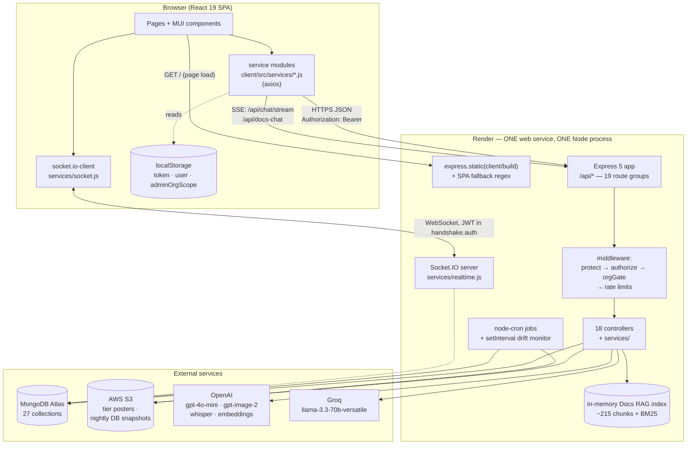

# 01 — System Architecture

**Part of the [Sales Tracker platform handover pack](00-START-HERE.md).** This document is the
mental model for the whole system: what the moving parts are, how a request travels from a browser
click to a MongoDB document and back, how the multi-tenancy that shapes *every* query works, where
each subsystem's code physically lives, and which architectural decisions will bite you if you do
not know about them. Everything below is grounded in the code as it exists at commit `7b0cafa`
(2026-08-31); every non-obvious claim carries a `file:line` citation so you can verify it yourself.
Where the older `docs/engineering/` set contradicts this, that set is wrong — see
[§15](#15-where-the-older-docsengineering-docs-are-now-wrong).

---

## 1. At a glance

| Property | Value | Source |
|---|---|---|
| Architecture style | Monolith. One Node process serves the API **and** the built React SPA. | `server/server.js:105-115` |
| Backend | Express **v5** + Mongoose **v9**, CommonJS (`require`, not ESM) | `server/package.json` |
| Frontend | React **19** + MUI **v7** + React Router **v7**, Create React App (`react-scripts` 5.0.1) | `client/package.json` |
| Server size | 168 JS files, ~29,900 lines (excl. `node_modules`) | measured |
| Client size | 200 JS files, ~50,900 lines | measured |
| Database | MongoDB Atlas, 27 collections / 27 Mongoose models | `server/models/` |
| API surface | 19 route groups mounted under `/api` | `server/server.js:35-53` |
| Controllers | 18 files, ~8,100 lines | `server/controllers/` |
| Auth | JWT bearer, HS256, no refresh-token rotation | `server/models/User.js:85-89` |
| Roles | `admin`, `team_lead`, `manager`, `skillhub` | `server/models/User.js:32` |
| Tenants | `luc`, `skillhub_training`, `skillhub_institute` | `server/config/organizations.js:1-6` |
| Realtime | Socket.IO on the same HTTP server, org-room broadcast | `server/services/realtime.js` |
| Streaming | Server-Sent Events for both chatbots | `server/controllers/chatController.js:33-37` |
| Dev ports | client **3001**, server **5001** | `client/package.json` scripts, `server/.env` |
| Production | Single Render web service | `docs/handover/04-deployment-and-infrastructure.md` |

**There is no separate backend-for-frontend, no queue, no cache server, no microservices.** State
lives in MongoDB; everything else is either in-process memory (Docs RAG index, chat classifier
cache, tenant snapshot cache) or S3 (tier posters, nightly DB snapshots).

---

## 2. System context

### 2.1 Component diagram



### 2.2 The same thing in ASCII, if mermaid does not render

```
  ┌──────────────────────── Browser ────────────────────────┐
  │  React 19 SPA  ·  MUI 7  ·  React Router 7              │
  │  AuthContext (auth ONLY) → localStorage: token/user     │
  │  axios service modules   ─── HTTPS JSON ──┐             │
  │  socket.io-client        ─── WebSocket ───┤             │
  │  EventSource-style SSE   ─── /api/chat ───┤             │
  └───────────────────────────────────────────┼─────────────┘
                                              │
  ┌────────────── Render web service (1 Node process) ──────────────┐
  │                                           ▼                     │
  │  helmet → cors → express.json → /api/* routers                  │
  │      │                                                          │
  │      ├─ protect (JWT verify + User lookup + isActive)           │
  │      ├─ authorize('admin', …)      role gate                    │
  │      ├─ orgGate('luc')             tenant gate (some routes)    │
  │      ├─ rate limiters              (exports pivot, institute)   │
  │      └─ controller → buildScopeFilter/canAccessDoc → Mongoose   │
  │                                                                 │
  │  Socket.IO attached to the SAME http.Server (path /socket.io)   │
  │  node-cron: 00:30 DB snapshot · 08:00 birthdays                 │
  │  setInterval: 24h admission-drift monitor                       │
  │  in-memory: Docs RAG chunks + BM25, classifier cache            │
  │                                                                 │
  │  NODE_ENV=production → express.static(client/build)             │
  │                        + GET /^(?!\/api).*/ → index.html        │
  └───────┬──────────────┬─────────────┬─────────────┬─────────────┘
          │              │             │             │
     MongoDB Atlas    AWS S3        OpenAI         Groq
     (27 colls)   (posters +     (chat, images,  (RAG + router
                   DB backups)    whisper, emb)   primary LLM)
```

### 2.3 Why it is shaped like this

The whole thing is deliberately one process. There is no separate API host, so:

- **No CORS problem in production** — the SPA and the API share an origin, and
  `API_BASE_URL` collapses to the relative string `'/api'`
  (`client/src/utils/constants.js:157-159`).
- **Socket.IO needs no separate URL** — the client derives the socket origin by stripping the
  trailing `/api` from `API_BASE_URL`, which yields `''` (same origin) in production and
  `http://localhost:5001` in development (`client/src/services/socket.js:6`).
- **Cron jobs are in-process.** There is no scheduler service; `node-cron` and a bare `setInterval`
  run inside the web dyno (`server/server.js:150-186`). **Consequence: if Render scales the service
  to more than one instance, every scheduled job runs once per instance.** Today it is a single
  instance, which is the only reason this is safe.

---

## 3. The request lifecycle

### 3.1 Sequence

```mermaid
sequenceDiagram
    participant B as Browser (service module)
    participant E as Express app
    participant P as protect
    participant A as authorize / orgGate
    participant C as controller
    participant M as Mongoose → Atlas
    participant H as errorHandler

    B->>E: POST /api/students  (Authorization: Bearer <JWT>)
    E->>E: helmet → cors → express.json
    E->>P: router.use(protect)
    P->>P: split "Bearer <token>", jwt.verify(token, JWT_SECRET)
    P->>M: User.findById(decoded.id)
    M-->>P: user doc (or null)
    alt no token / bad token / no user / isActive === false
        P-->>B: 401 { success:false, message }
    end
    P->>A: req.user = user; next()
    A->>A: roles.includes(req.user.role)?
    alt role not allowed
        A-->>B: 403 { success:false, message }
    end
    A->>C: next()
    C->>C: buildScopeFilter(req) / resolveOrganization(req)
    C->>M: Model.find(filter) / Model.create({...})
    M-->>C: docs
    C->>C: canAccessDoc(req.user, doc) on single-doc reads/writes
    C-->>B: 200 { success:true, count, data }
    Note over C,H: any throw → next(error)
    C->>H: next(error)
    H-->>B: 4xx/500 { success:false, message }
```

### 3.2 Step by step, with the real code

**1. Middleware chain (global).** `server/server.js:20-32`, in this order:

| Order | Middleware | Note |
|---|---|---|
| 1 | `helmet({ crossOriginResourcePolicy: 'same-site', contentSecurityPolicy: false })` | CSP is **deliberately off** — CRA's inline styles and dynamic chunks would need a real pass. Flagged for v2 in the code comment at `server/server.js:24`. |
| 2 | `cors()` | Wide open, no allowlist. Harmless in production (same origin) but means the API answers any origin. |
| 3 | `express.json()` | No explicit size limit → Express's 100 kb default. |
| 4 | `express.urlencoded({ extended: false })` | |

There is **no request logger**, **no global rate limiter**, and **no request-id/correlation-id
middleware**. Rate limiting exists only on two specific surfaces (§3.6).

**2. Routing.** Nineteen routers mounted at `server/server.js:35-53`. Each router applies its own
auth. The near-universal pattern is `router.use(protect)` at the top of the file, then per-route
`authorize(...)`:

```js
// server/routes/students.js:19-22
router.use(protect);
router.get('/stats', authorize('admin', 'team_lead', 'manager', 'skillhub'), getStudentStats);
```

**3. `protect` — authentication.** `server/middleware/auth.js:5-50`.

- Reads only the `Authorization: Bearer <token>` header. **No cookies anywhere in the system.**
- `jwt.verify(token, process.env.JWT_SECRET)`.
- **Then hits the database on every single request**: `req.user = await User.findById(decoded.id)`
  (`auth.js:27`). This is deliberate and load-bearing — the JWT payload contains only
  `{ id, role }` (`server/models/User.js:86`), so `organization` is *not* in the token and must be
  read fresh. It also means deactivating a user (`isActive: false`) takes effect on their very next
  request rather than at token expiry (`auth.js:36-41`).
- Every failure path returns **401** with the same generic body, so a client cannot distinguish
  "expired token" from "user deleted".

**4. `authorize(...roles)` — role gate.** `server/middleware/auth.js:53-63`. A plain
`roles.includes(req.user.role)` check returning 403. It knows nothing about organizations or
ownership — that is the controller's job.

**5. `orgGate(org)` — tenant gate.** `server/middleware/orgGate.js:4-10`. Returns 403 unless
`req.user.organization === org` exactly. Note this is a **strict equality check that admin does not
bypass** — an admin whose `User.organization` is `'luc'` passes `orgGate('luc')`, which is why the
LUC-only feature routes work for admin at all. Used on:

| Route group | Gate | File |
|---|---|---|
| `/api/exec-overview` | `orgGate('luc')` | `server/routes/execOverview.js:14` |
| `/api/team-entries` | `orgGate('luc')` | `server/routes/teamEntries.js:15` |
| `/api/tiers` | `orgGate('luc')` | `server/routes/tiers.js:18` |
| `/api/payment-plans` | `orgGate('luc')` | `server/routes/paymentPlans.js:17` |
| `POST /api/docs-chat` | `orgGate('luc')` | `server/routes/docsChat.js:320` |
| `/program-docs*` static | `orgGate('luc')` | `server/server.js:59-96` |

**6. Controller.** The dominant pattern is raw `try { … } catch (err) { next(err) }` — there is
**no `asyncHandler` wrapper**. Two caveats worth knowing before you rely on that sentence:

- **`announcementController.js` never forwards.** Both of its handlers (`getActive:8`,
  `acknowledge:29`) are declared `async (req, res)` — no `next` parameter — and answer errors inline
  with `res.status(500)`. They therefore bypass `middleware/errorHandler.js` completely: a Mongoose
  `CastError` on that route returns 500 where every other route returns 404. Several other
  controllers also answer inline for *specific* cases (409 on duplicate name, 400 on validation)
  while still forwarding everything else — that part is deliberate and fine.
- **A forgotten try/catch does not crash the process.** This is Express 5 (`5.1.0`), which
  auto-forwards a rejected promise from an async handler to the error middleware. Verified
  empirically: an uncaught async throw returns 500 through the error handler and the process stays
  up. Write the try/catch for control over the response shape, not to prevent a crash.

Inside, the controller does the tenant scoping (§4) and talks to Mongoose directly; there is no
repository or service layer for CRUD. Heavier read paths (exports, exec-overview, institute)
delegate to `server/services/`.

**7. Response envelope.** Consistent by convention, not by a helper:

```js
// success
{ success: true, count?: n, data: <object|array>, ...extras }
// failure
{ success: false, message: "..." }
```

**8. Error handler.** `server/middleware/errorHandler.js`, mounted **last** at `server/server.js:117`.
It maps three Mongoose failure modes and swallows everything else into a 500:

| Condition | Status | Message |
|---|---|---|
| `err.name === 'CastError'` (bad ObjectId) | 404 | `Resource not found` |
| `err.code === 11000` (duplicate key) | 400 | `Duplicate field value entered` |
| `err.name === 'ValidationError'` | 400 | array of Mongoose messages |
| anything else | `err.statusCode ?? 500` | `err.message ?? 'Server Error'` |

Two things to know: it does `console.log(err)` unconditionally at `errorHandler.js:6` (so raw errors
land in Render's log stream), and controllers frequently bypass it entirely by returning
`res.status(4xx).json(...)` inline. Some controllers throw an `Error` with a hand-set
`.statusCode` and let the handler surface it — see `assertDatasetAccess` in
`server/controllers/exportController.js:13-50`.

**9. Unhandled rejections.** `server/server.js:190-194` closes the server and calls
`process.exit(1)`. On Render that is a restart, which takes roughly 90 seconds of downtime. A single
un-awaited rejection anywhere therefore takes the site down briefly.

### 3.3 The two non-JSON response shapes

| Shape | Where | Notes |
|---|---|---|
| **SSE** (`text/event-stream`) | `POST /api/chat/stream` (`server/controllers/chatController.js:33-37`), `POST /api/docs-chat` (`server/routes/docsChat.js:336-339`) | Sets `Cache-Control: no-cache, no-transform`, `Connection: keep-alive`, `X-Accel-Buffering: no`, then `flushHeaders()`. Events are `meta`, `delta`, `tool-start`, `tool-end`, `done`, `error`. Written via `res.write('event: X\n')` + `data: <json>\n\n` (`server/services/chatService.js:473-474`). |
| **Static files behind auth** | `/program-docs/*`, `/program-docs-highlighted/*`, `/program-docs-snippets/*` (`server/server.js:59-96`) | `express.static` mounted *behind* `docsRagEnabled → protect → orgGate('luc')`, with `fallthrough: false` so a miss 404s instead of falling through to the SPA. |

### 3.4 Route-ordering convention you must not break

Express matches routes in mount order, so every router puts literal paths **before** `/:id`. The
code says so loudly in several places:

```js
// server/routes/commitments.js:30-31
// IMPORTANT: Specific routes MUST come BEFORE parameterized routes like /:id
// Otherwise /:id will match everything
```

The same comment appears in `server/routes/students.js:21`, `server/routes/meetings.js:26`,
`server/routes/exports.js:18` and `server/routes/institute.js:65`. If you add
`GET /api/students/export` after the `/:id` route, it will silently be handled by `getStudent` with
`id = "export"` and return a 404 "Resource not found" from the CastError branch.

### 3.5 Auth on the client side

`client/src/services/authService.js` sets the token as an **axios default header**
(`axios.defaults.headers.common['Authorization']`, line 9) and mirrors it into `localStorage`.
`AuthContext` restores it on page load via `authService.initializeAuth()`
(`client/src/context/AuthContext.js:29`).

**Trap:** two other service modules *also* install a **global** `axios.interceptors.request.use`
that re-reads the token from `localStorage` —
`client/src/services/commitmentService.js:7-18` and `client/src/services/userService.js:11-23`.
These are not instance-scoped, so importing either module adds another interceptor to the shared
axios singleton. Together with `installAdminOrgInterceptor()` (`client/src/index.js:8`) the app runs
three request interceptors on one axios instance. They are individually idempotent and do not
currently conflict, but this is fragile: adding a fourth that mutates `config.params` could produce
surprising interactions. Consolidating these is on the roadmap
([10 — Known Issues](10-known-issues-and-roadmap.md)).

**There is no axios *response* interceptor anywhere in the client** (verified by grep). So a 401
from an expired JWT does **not** auto-logout or redirect to `/login`; the page simply shows an error
or an empty state until the user reloads and `PrivateRoute` notices there is still a stale `user` in
`localStorage`. This is a real UX bug, not a design choice.

### 3.6 Rate limiting

Only two surfaces are limited. Everything else — including `POST /api/auth/login` — is unlimited.

| Endpoint | Limit | Key | File |
|---|---|---|---|
| `POST /api/exports/pivot`, `POST /api/exports/template/:id` | 5 / minute | `req.user._id`, IP fallback | `server/middleware/exportRateLimit.js:6-24`, mounted `server/routes/exports.js:21,25` |
| `POST /api/institute/timetable/import` | 10 / minute | `req.user._id`, IP fallback | `server/routes/institute.js:29-36` |

---

## 4. Multi-tenancy — the design that shapes everything

This is the single most important section. Nearly every bug class in this codebase is a tenancy
mistake.

### 4.1 The model

One flat string field, `organization`, on every tenant-scoped collection. Three legal values, no
hierarchy, no `Organization` collection:

```js
// server/config/organizations.js:1-9
const ORG_LUC = 'luc';
const ORG_SKILLHUB_TRAINING = 'skillhub_training';
const ORG_SKILLHUB_INSTITUTE = 'skillhub_institute';
const ORGANIZATIONS = [ORG_LUC, ORG_SKILLHUB_TRAINING, ORG_SKILLHUB_INSTITUTE];
const SKILLHUB_ORGS = [ORG_SKILLHUB_TRAINING, ORG_SKILLHUB_INSTITUTE];
const isSkillhub = (org) => SKILLHUB_ORGS.includes(org);
const isLuc = (org) => org === ORG_LUC;
```

"Skillhub" is a *concept*, not a value — there is no `organization: 'skillhub'`. Anywhere you need
"either Skillhub branch" you must use `isSkillhub(org)` or `SKILLHUB_ORGS`.

On `User` the field is required with a default and indexed
(`server/models/User.js:35-41`), so **there is no such thing as a user without an organization** —
including admins, whose `organization` is `'luc'`. That fact is load-bearing: it is why `orgGate('luc')`
lets admins into the LUC-only features.

### 4.2 The four helpers — all in `server/middleware/auth.js`

Despite living in a middleware file, three of these are **not** middleware; they are plain functions
that controllers call.

#### `buildScopeFilter(req)` — `auth.js:69-86`

Builds the Mongoose filter object for **list** queries.

```js
exports.buildScopeFilter = (req) => {
    const user = req.user;
    const filter = {};
    if (user.role === 'admin') {
        if (req.query && req.query.organization) filter.organization = req.query.organization;
    } else {
        filter.organization = user.organization;
    }
    if (user.role === 'team_lead' || user.role === 'skillhub') filter.teamLead = user._id;
    return filter;
};
```

Resulting filter per role:

| Role | Filter produced | Effect |
|---|---|---|
| `admin`, no `?organization` | `{}` | every org, every team |
| `admin`, `?organization=luc` | `{ organization: 'luc' }` | one org, every team |
| `team_lead` | `{ organization: 'luc', teamLead: <own _id> }` | own team only |
| `manager` | `{ organization: 'luc' }` | all LUC teams, read-only by route gating |
| `skillhub` | `{ organization: 'skillhub_institute', teamLead: <own _id> }` | own branch only |

Two things worth internalising:

- **`team_lead` and `skillhub` are treated identically.** The Skillhub branch logins are modelled as
  team leads that happen to sit in a different org. Every Skillhub row's `teamLead` FK points at the
  branch login user.
- **`organization` is only applied when it is truthy.** Passing `?organization=all` to a generic
  endpoint would produce `{ organization: 'all' }` and silently return zero rows. Nothing today sets
  that (`AdminOrgTabs` only offers the three real values —
  `client/src/components/AdminOrgTabs.js:36-38`; the `'all'` scope exists only inside the Export
  Center, which uses its own `resolveOrgScope` per builder), but nothing guards it either.

#### `canAccessDoc(user, doc)` — `auth.js:91-100`

The single-document counterpart, used on GET/PUT/DELETE-by-id. Admin always true; otherwise the
doc's `organization` must match, and for `team_lead`/`skillhub` the `teamLead` FK must equal the
caller. It handles both a populated `doc.teamLead._id` and a raw ObjectId (`auth.js:96`).

**Trap:** it returns `true` for a doc with **no** `organization` field
(`if (doc.organization && doc.organization !== user.organization)` — line 94). Legacy rows that
predate multi-tenancy are therefore visible to everyone in their team. That is exactly what
`server/scripts/migrateOrganization.js` exists to fix; run it after any bulk import.

#### `resolveOrganization(req)` — `auth.js:105-110`

Decides what `organization` to stamp on a **new** document. Non-admins get their own org and the
request body is ignored (so a team lead cannot forge a Skillhub row). Admins get
`req.body.organization`, **defaulting to `'luc'`** — meaning an admin who creates a record without
explicitly picking an org silently creates a LUC record.

#### `orgGate(org)` — `server/middleware/orgGate.js`

The only one that *is* middleware. Covered in §3.2 step 5.

### 4.3 Which controllers actually use them

Grep count of `buildScopeFilter | canAccessDoc | resolveOrganization` call sites:

| File | Calls |
|---|---|
| `server/controllers/commitmentController.js` | 12 |
| `server/controllers/studentController.js` | 10 |
| `server/controllers/meetingController.js` | 8 |
| `server/controllers/paymentPlanController.js` | 6 |
| `server/controllers/consultantController.js` | 5 |
| `server/controllers/hourlyController.js` | 4 |
| `server/services/exports/pivots/{meetings,commitments}.js` | 2 each |
| `server/controllers/aiController.js` | 2 |
| `server/controllers/userController.js` | 1 |

Controllers **not** in that list use a different, equally valid mechanism:

- **`instituteController.js`** hard-pins everything to one org. `assertInstitute(req, res)`
  (`instituteController.js:22-28`) allows admin, or a `skillhub` login whose org *is*
  `skillhub_institute` — a Training login gets 403 — and then every query literally sets
  `{ organization: INSTITUTE }` (e.g. `instituteController.js:36`). There is no scope-filter call
  because there is nothing to vary.
- **`exportController.js`** has its own hard-wired permission matrix,
  `assertDatasetAccess(user, dataset, organization)` at `exportController.js:13-50`, plus a
  `resolveOrgScope(user, bodyOrg)` per dataset builder. This is where the deliberate **manager
  exception** lives: a manager is `organization: 'luc'` everywhere else, but on
  `/exports → Students` may pick LUC / Training / Institute / `all`.
- **`teamEntryController.js`, `tierController.js`, `execOverviewController.js`,
  `paymentPlanController.js`** sit behind `orgGate('luc')` and often just hardcode `'luc'` in their
  emits and filters (e.g. `teamEntryController.js:126`).

**If you add a controller, pick one of these three patterns explicitly.** Silently doing none of
them is how you leak one tenant's data to another.

### 4.4 The client half: `adminOrgScope`

Admin is the only role that can *choose* a tenant, and that choice lives in `localStorage` under the
key `adminOrgScope`, defaulting to `'luc'`:

- `client/src/utils/adminOrgScope.js:8-40` — getter, setter, and a `useAdminOrgScope()` hook that
  re-renders on a custom `adminOrgScopeChange` event *and* on the cross-tab `storage` event.
- `client/src/components/AdminOrgTabs.js` — the `[LUC] [Skillhub Training] [Skillhub Institute]`
  toggle, rendered only for admins.
- `client/src/utils/axiosAdminOrgInterceptor.js:17-51`, installed once at
  `client/src/index.js:8` — **appends `organization=<scope>` to every admin GET** that does not
  already carry one, either as a param or in the URL string. It fails open (a `try/catch` that
  swallows) so it can never block a request.

**This is the single most surprising piece of the tenancy design.** `buildScopeFilter` says "admin
sees all orgs unless they opt in", but in practice the browser opts in on *every* GET. An admin is
therefore always looking at exactly one tenant in the UI. If you test an endpoint with curl and no
`?organization`, you get cross-org results the UI never shows you — and vice versa, a bug that only
reproduces in the browser is often this interceptor.

`authService.logout()` explicitly clears the key (`client/src/services/authService.js:35`) because
otherwise the next login inherits the previous session's scope and silently filters everything.

### 4.5 The frontend "dispatcher" pattern

Where LUC and Skillhub need genuinely different UI, the route points at a thin dispatcher page that
resolves the caller's effective org and renders one of two implementations. Do **not** add
`if (org === …)` branches inside the LUC page.

| Route | Dispatcher | LUC impl | Skillhub impl |
|---|---|---|---|
| `/student-database` | `client/src/pages/StudentDatabasePage.js` | `LucStudentDatabasePage.js` | `SkillhubStudentDatabasePage.js` |
| `/meetings` | `client/src/pages/MeetingTrackerPage.js` | `LucMeetingTrackerPage` (same file) | `SkillhubMeetingTrackerPage.js` |
| `/hourly-tracker` | `client/src/pages/HourlyTrackerPage.js` | in-file | `SkillhubHourlyTrackerPage.js` |

The effective org is `user.organization` for non-admins, or the current `adminOrgScope` for admins.

---

## 5. Server directory layout

```
server/
├── server.js                  # Entry point. Middleware order, 19 route mounts,
│                              # auth-gated static PDFs, health check, prod static
│                              # serve, Socket.IO attach, cron registration.
├── config/
│   ├── db.js                  # mongoose.connect(MONGODB_URI). process.exit(1) on failure.
│   ├── organizations.js       # The tenant enum + isLuc/isSkillhub helpers.
│   ├── docsRagConfig.js       # Docs RAG tunables, parsed from env at require-time.
│   └── instituteSubjects.js   # Canonical subject list + fuzzy matcher for Institute.
├── middleware/
│   ├── auth.js                # protect, authorize, buildScopeFilter, canAccessDoc,
│   │                          # resolveOrganization.  ← read this first
│   ├── orgGate.js             # Single-tenant route gate.
│   ├── errorHandler.js        # Terminal error middleware.
│   ├── exportRateLimit.js     # 5/min limiter for pivot + template endpoints.
│   └── docsRagEnabled.js      # Kill switch → 503 for the whole Docs RAG feature.
├── models/                    # 27 Mongoose schemas. See doc 03.
├── routes/                    # 19 routers. Thin: mount protect/authorize/orgGate,
│                              # delegate to a controller. No logic here.
├── controllers/               # 18 files, ~8.1k lines. Where request handling AND
│                              # most business logic live. try/catch + next(error).
├── services/                  # Reusable logic that outgrew a controller:
│   ├── realtime.js            #   Socket.IO server + emitToOrg helpers
│   ├── s3.js                  #   S3 client, presigned URLs; no-ops when unconfigured
│   ├── dbSnapshot.js          #   Nightly full-DB dump to S3
│   ├── driftMonitor.js        #   Closed-commitment-without-Student watchdog
│   ├── birthdayNotifier.js    #   Institute student birthday reminders
│   ├── announcer.js           #   Creates Announcement docs + broadcasts them
│   ├── aiService.js           #   OpenAI dashboard analysis
│   ├── chatService.js         #   Tracker chatbot: SSE + tool-calling loop
│   ├── chatTools.js           #   Tool schemas + implementations for the chatbot
│   ├── classifierService.js   #   Groq→OpenAI query router (tracker vs docs)
│   ├── tenantSnapshot.js      #   Cached live DB profile injected into chat prompts
│   ├── docsRagService.js      #   In-memory RAG index, retrieval, generation
│   ├── execOverview/          #   aggregate.js + bucketing.js for the leadership dashboards
│   ├── exports/               #   templates.js + pivots/{students,commitments,meetings,
│   │                          #   hourly,_shared}.js — the Export Center engine
│   └── institute/             #   scheduleParser.js (pure Buffer→objects workbook parser)
├── scripts/                   # ~45 one-off + operational scripts (seeds, backfills,
│                              # imports, audits, ingest). NOT part of the running app.
├── tests/                     # Jest + supertest + mongodb-memory-server.
│   ├── exports/ meetings/ institute/ commitments/   ← run by `npm test`
│   ├── execOverview/ hourly/                        ← NOT run by `npm test`
├── utils/                     # hourlyConstants.js, importCSV.js, 3 legacy seed scripts.
└── dumps/                     # Committed JSON backups from destructive cleanups.
```

**What belongs where, as a rule:**

| If you are writing… | Put it in |
|---|---|
| A new endpoint's HTTP shape + auth | `routes/<name>.js` |
| Request validation, scoping, the Mongoose calls | `controllers/<name>Controller.js` |
| Logic reused by ≥2 controllers, or that needs unit tests without HTTP | `services/` |
| A pure transform (parse a workbook, bucket a date) | `services/<domain>/` as a pure function |
| Tenant/role logic | `middleware/auth.js` — do **not** re-implement scoping locally |
| A one-time data fix | `scripts/`, and make it idempotent |

Note the asymmetry: `hourlyController.js` is 1,795 lines and `instituteController.js` is 950. Both
are past the point where the service layer should have absorbed them; treat that as known debt
rather than a pattern to copy.

---

## 6. Client directory layout and frontend architecture

```
client/src/
├── index.js            # ReactDOM root. installAdminOrgInterceptor() BEFORE render.
│                       # Also patches window.ResizeObserver to silence a
│                       # react-data-grid v7 + CRA overlay false-positive (lines 23-59).
├── App.js              # ThemeProvider → AuthProvider → FullscreenProvider → Router.
│                       # Every route + HomeRedirect. 4 always-mounted overlays.
├── theme.js            # The global MUI theme (Inter, 12px radius, gradient AppBar).
├── context/
│   ├── AuthContext.js      # THE ONLY global app state. user, token, login, logout.
│   └── FullscreenContext.js# Sidebar-hiding focus mode.
├── hooks/
│   └── useRealtimeRefresh.js # Debounced socket-event → refetch bridge.
├── services/           # ONE MODULE PER API DOMAIN. All axios. 21 files.
├── pages/              # 23 route-level components (incl. dispatchers).
├── components/         # 34 top-level + 14 feature folders (see table below).
├── config/exportColumns/   # Per-dataset column definitions for the Export Center.
└── utils/              # constants.js (API_BASE_URL, enums, colors), weekUtils.js,
                        # adminOrgScope.js, axiosAdminOrgInterceptor.js, classifyQuery.js,
                        # and the *Design.js / *Theme.js token systems.
```

| Component folder | Files | Owns |
|---|---|---|
| `dashboard/` | 13 | `DashboardShell`, KPI strips, hero, tabs — the shared page scaffold |
| `exports/` | 12 | Export Center tabs, preview grid, download buttons |
| `meetings/` | 11 | Meeting Tracker dialogs and boards |
| `students/` | 8 | Student table, filters, form pieces |
| `commitments/` | 8 | Commitment cards, dialogs, filters |
| `institute/` | 7 | Teachers / Timetable / Attendance / Tests tabs |
| `skillhub/` | 7 | `AdminSkillhubView` and Skillhub-specific dialogs |
| `tiers/` | 6 | Tier Fight board + announce modal |
| `charts/` | 4 | Recharts/ECharts wrappers |
| `chat/` | 4 | `ChatPanel`, `FloatingChatLauncher`, message rendering |
| `paymentPlans/` | 3 | Payment plan panel |
| `admin/` | 2 | AI usage tabs, Docs RAG admin panel |
| `docs/`, `shared/` | 1 each | PDF source chips; horizontal scroller |

### 6.1 State management: deliberately minimal

**React Context is used for authentication and nothing else.** There is no Redux, no Zustand, no
TanStack Query. `AuthContext` (`client/src/context/AuthContext.js`) exposes exactly
`{ user, token, loading, login, logout, updatePassword, isAuthenticated, isAdmin, isTeamLead, isConsultant }`
(lines 94-105). `FullscreenContext` is a UI-only sibling.

Everything else is **local `useState` + a `useEffect` that calls a service module**. Server data is
re-fetched on mount and on filter change; there is no shared cache, so two pages showing the same
data each fetch it. This is the dominant pattern in ~200 client files — follow it rather than
introducing a fifth state paradigm.

Persistent client state lives in `localStorage` under exactly three keys: `token`, `user`,
`adminOrgScope`.

Two vestigial details worth knowing: `AuthContext` still exposes `isConsultant()` (line 92) for a
role that no longer exists in the `User` enum, and `client/src/pages/ConsultantDashboard.js` is dead
code — not imported, not routed.

### 6.2 Service modules

One file per API domain in `client/src/services/`, each building URLs from
`API_BASE_URL` and returning `response.data`:

| Module | Backs |
|---|---|
| `authService.js` | `/api/auth` — plus it owns the axios default auth header |
| `userService.js`, `consultantService.js` | `/api/users`, `/api/consultants` |
| `commitmentService.js`, `studentService.js`, `meetingService.js`, `hourlyService.js` | the four trackers |
| `instituteService.js` | `/api/institute` (teachers, timetable, attendance, tests) |
| `execOverviewService.js`, `teamEntryService.js` | leadership dashboards |
| `tierService.js`, `paymentPlanService.js`, `announcementService.js`, `notificationService.js` | supporting features |
| `aiService.js`, `chatService.js`, `docsChatService.js` | the three AI surfaces |
| `exportsApi.js` | `/api/exports` (server-side pivots + cursor paging) |
| `exportService.js`, `xlsxBuilder.js` | **client-side** xlsx/CSV writing (`xlsx` + `file-saver`) |
| `socket.js` | the Socket.IO singleton |

`API_BASE_URL` is computed once (`client/src/utils/constants.js:157-159`): `'/api'` when
`NODE_ENV === 'production'`, `'http://localhost:5001/api'` otherwise. **Nothing sets
`axios.defaults.baseURL`** — `userService.js:6-9` carries an explicit comment explaining that doing
so would double-prefix every request to `/api/api/...` in production. Do not "fix" that.

### 6.3 Routing and guards

`client/src/App.js` holds every route. Access control is `PrivateRoute`
(`client/src/components/PrivateRoute.js:6-31`): it shows a spinner while `AuthContext.loading`,
redirects unauthenticated users to `/login`, and redirects role mismatches to `/`.

**`PrivateRoute` is UX, not security.** It reads `user.role` out of `localStorage`-hydrated context.
Every real check is the server's `authorize()` / `orgGate()` / scope filter. A user who edits
`localStorage` sees a page shell and empty data, not someone else's records.

`HomeRedirect` (`App.js:33-52`) sends each role to its landing page: admin →
`/admin/dashboard`, team_lead → `/team-lead/dashboard`, manager → `/student-database`, skillhub →
`/skillhub/dashboard`.

| Route | Roles allowed (`PrivateRoute`) | Page |
|---|---|---|
| `/login` | public | `Login.js` |
| `/admin/dashboard` | admin | `AdminDashboard.js` |
| `/team-lead/dashboard` | team_lead | `TeamLeadDashboard.js` |
| `/skillhub/dashboard` | skillhub | `SkillhubDashboard.js` |
| `/student-database` | admin, team_lead, manager, skillhub | dispatcher |
| `/commitments` | admin, team_lead, skillhub | `CommitmentsPage.js` |
| `/meetings` | admin, team_lead, skillhub | dispatcher |
| `/hourly-tracker` | admin, team_lead, skillhub | dispatcher |
| `/exports` | admin, team_lead, manager, skillhub | `ExportCenterPage.js` |
| `/institute` | admin, skillhub | `InstitutePage.js` |
| `/leadership-dashboard` | admin, team_lead | `ExecutiveOverviewPage.js` |
| `/team-dashboard/:teamLeadId`, `/team-dashboard` | admin, team_lead / team_lead | `TeamDetailPage.js` |
| `/consultant-performance` | admin, team_lead | `ConsultantPerformancePage.js` |
| `/tiers` | admin, team_lead | `TierPage.js` |
| `/payment-plans` | admin, team_lead | `PaymentPlanTrackerPage.js` |
| `/monthly-targets` | admin, team_lead | `MonthlyTargetsPage.js` (no longer in the sidebar) |
| `/admin/reconciliation` | admin | `AdminReconciliationPage.js` |
| `/pdf-viewer` | admin, team_lead | `PdfViewer.js` |
| `/executive-overview` | — | redirect → `/leadership-dashboard` |
| `/admin/docs-rag`, `/admin/api-costs` | — | redirect → admin dashboard with a `?section=` query |
| `*` | — | redirect → `/` |

Four components are mounted **outside** `<Routes>` and therefore render on every page
(`App.js:296-303`): `AnnouncementBanner`, `TierAnnounceModal`, `FloatingChatLauncher`,
`FloatingFullscreenButton`. Each self-hides when it has nothing to show or the user is on `/login`.

### 6.4 Two theming systems (do not merge them)

- **`client/src/theme.js`** — the app-wide MUI theme (light mode, Inter, 12 px radius, gradient
  AppBar). Applies to older pages.
- **`DashboardShell`** (`client/src/components/dashboard/DashboardShell.js`) — the newer scaffold
  used by 12+ pages. It nests a *second* MUI `ThemeProvider` built from CSS-variable token sets
  (`LIGHT_TOKENS` / `DARK_TOKENS` in `utils/dashboardTheme.js`) so that MUI components inside the
  dashboard subtree pick up dark mode automatically. Tokens come in two families — `--d-*`
  (dashboard) and `--t-*` (tracker) — deliberately kept separate.

A page adopting `DashboardShell` passes its own `sidebar` (Admin, team-lead, or manager variants
exist as separate components) so the shell stays layout-only.

---

## 7. Realtime: Socket.IO

### 7.1 Server

`server/services/realtime.js`, attached to the **same** `http.Server` returned by `app.listen()`
(`server/server.js:127`), on path `/socket.io`.

- **No-op in tests.** `initRealtime` returns `null` immediately when `NODE_ENV === 'test'`
  (`realtime.js:17`), and the whole `require('socket.io')` is inside a `try/catch` so a missing
  dependency degrades to "realtime off" rather than a boot failure (`realtime.js:18-24`).
- **Handshake auth reuses the REST JWT** (`realtime.js:34-50`): the client puts the token in
  `socket.handshake.auth.token`, the server `jwt.verify`s it with the same `JWT_SECRET` and loads
  the user, rejecting inactive accounts. So a socket is exactly as authenticated as an API call.
- **Rooms** (`realtime.js:52-61`), joined on connect:

| Room | Who joins |
|---|---|
| `org:<organization>` | everyone |
| `org:<organization>:admin` | admins |
| `org:<organization>:team:<userId>` | team leads |

- **`emitToOrg(organization, event, payload)`** (`realtime.js:68-71`) is the one broadcast
  primitive; `emitTeamEntry`, `emitConsultant`, `emitUser` are thin wrappers. All are **no-ops when
  `io` is null**, so nothing breaks with realtime disabled.

**Design rule stated in the file header:** events carry *thin identifiers only* (ids, year, month) —
never computed rows. The client's job is to re-run its normal fetch. Keep it that way; it is what
makes the socket layer optional rather than a second source of truth.

### 7.2 Event catalogue (all current emit sites)

| Event | Emitted from | Payload |
|---|---|---|
| `user:created` | `authController.js:45` | `{ id, role, teamName }` |
| `consultant:created` / `:updated` / `:deactivated` / `:deleted` | `consultantController.js:88,151,192,220` | `{ id, … }` |
| `teamEntry:upserted` / `:bulk` / `:deleted` | `teamEntryController.js:126,163,236,251` | `{ consultant, teamLead, year, month }` |
| `paymentPlan:created` / `:updated` / `:deleted` | `paymentPlanController.js:76,102,123` | `{ id }` |
| `tier-image` | `tierController.js:274` | `{ _id, month, year, monthName }` |
| `announcement` | `services/announcer.js:45,79` | announcement payload (`toPayload`) |
| Institute events | `instituteController.js:30` via a local `emit()` helper | varies |

### 7.3 Client

- `client/src/services/socket.js` — a lazily created singleton with `autoConnect: false`,
  `transports: ['websocket', 'polling']`. `connectSocket(token)` sets `s.auth = { token }` and
  reconnects, so a password change (which issues a new token) cleanly re-authenticates.
- `client/src/context/AuthContext.js:42-45` — a `useEffect` on `token` that connects on login and
  disconnects on logout. This is the *only* place connect/disconnect is called.
- `client/src/hooks/useRealtimeRefresh.js:17-49` — the consumption pattern: subscribe to a list of
  event names, debounce 500 ms, coalesce bursts, optionally ignore events for a year the user is not
  viewing, and **also refetch once on (re)connect** so a sleeping tab catches up.

Current consumers: `ExecutiveOverviewPage`, `TeamDetailPage`, `ConsultantPerformancePage`,
`AnnouncementBanner`, `TierAnnounceModal`, `PaymentPlanPanel`.

---

## 8. Scheduled and background work

All of it runs inside the web process, registered at the bottom of `server/server.js`. Every job is
skipped when `NODE_ENV === 'test'`.

| Job | Schedule | Registered at | Implementation | Notes |
|---|---|---|---|---|
| **Docs RAG index load** | once, at boot (not a cron) | `server/server.js:136` | `services/docsRagService.loadChunks()` | Loads ~215 `DocChunk` docs + builds the BM25 index into memory. Boot does **not** block on it; failure logs and leaves `/api/docs-chat` returning 503 until an admin re-ingests. |
| **Admission drift monitor** | 30 s after boot, then every 24 h (`setInterval`) | `server/server.js:150-151` | `services/driftMonitor.js:59-74` | Counts LUC commitments with `admissionClosed: true`, closed >7 days ago, and no linked `studentId`; posts a bell notification to every active admin. Idempotent per admin per day (`driftMonitor.js:38-45`). |
| **Nightly DB snapshot** | `30 0 * * *` **Asia/Dubai** | `server/server.js:162-170` | `services/dbSnapshot.js` | Dumps every non-`system.` collection as gzipped JSON to `s3://<bucket>/db-snapshots/YYYY-MM-DD/`, plus `_manifest.json` with per-collection counts. **Skipped entirely with a console warning when `s3.isEnabled()` is false.** Reads the whole collection into memory (`find({}).toArray()`) — fine at current scale, would need streaming at 10× the data. |
| **Student birthday reminders** | `0 8 * * *` **Asia/Dubai** | `server/server.js:177-186` | `services/birthdayNotifier.js` | Skillhub **Institute only**. Matches on month + day evaluated in the Asia/Dubai calendar (`birthdayNotifier.js:20-27`) so the reminder lands on the branch's own "today". Posts one heads-up the day before and one on the morning. Idempotent. |

Two consequences to keep in mind:

1. **Timezone is Asia/Dubai for the crons but UTC for the snapshot key.** `dbSnapshot.js:21` stamps
   the S3 prefix from `new Date().toISOString()`, which is UTC — a run at 00:30 Dubai is 20:30 UTC
   the **previous** day. So `db-snapshots/2026-08-30/` contains the backup taken at 00:30 on
   31 August Dubai time. Do not misread the folder dates during a restore.
2. **Scaling the Render service horizontally would duplicate every job.** There is no leader
   election or distributed lock. The birthday and drift jobs are idempotent so duplication is
   harmless there; the snapshot would simply write the same keys twice.

---

## 9. Production build and static serving

```
Render build   →  npm run build   →  cd client && npm install && npm run build
                                     (CRA emits client/build/)
Render start   →  npm start       →  cd server && npm start  →  node server.js
```
(root `package.json` scripts.)

Then, **only when `NODE_ENV === 'production'`** (`server/server.js:105-115`):

```js
app.use(express.static(path.join(__dirname, '../client/build')));

// All other GET requests not handled by API routes serve the React app
app.get(/^(?!\/api).*/, (req, res) => {
    res.sendFile(path.join(__dirname, '../client/build', 'index.html'));
});
```

Things to understand about those seven lines:

- **The SPA fallback is a regular expression, not a string.** Express 5 removed the `'*'` string
  wildcard that Express 4 accepted; `app.get('*', …)` throws at boot on this version. The negative
  lookahead `(?!\/api)` is what keeps unknown `/api/...` paths returning a real 404 instead of HTML.
- **Order matters and is already correct.** The three auth-gated static PDF mounts sit at
  `server/server.js:59-96`, *before* the fallback, each with `fallthrough: false` — so a missing
  program PDF 404s rather than silently returning `index.html` (which would make the PDF viewer
  render a blank page and is a genuinely confusing failure mode).
- **In development none of this runs.** CRA's dev server serves the SPA on **3001** and proxies
  nothing — the client reaches the API by absolute URL `http://localhost:5001/api`, which is why the
  permissive `cors()` at `server/server.js:28` is required locally.
- **`PORT` defaults to 5000, not 5001** (`server/server.js:119`). If `server/.env` is missing, the
  server comes up on a port the dev client is not configured to call and every request fails with a
  connection error. This bites everyone once.

---

## 10. Subsystem map — where each feature lives

| Subsystem | API prefix | Server | Client |
|---|---|---|---|
| Auth | `/api/auth` | `routes/auth.js`, `controllers/authController.js`, `middleware/auth.js` | `context/AuthContext.js`, `services/authService.js`, `pages/Login.js` |
| Users & consultants | `/api/users`, `/api/consultants` | `userController.js`, `consultantController.js` | `UserManagementDialog.js`, `ConsultantManagementDialog.js` |
| Commitment / Demo Tracker | `/api/commitments` | `commitmentController.js` (853 lines) | `pages/CommitmentsPage.js`, `components/commitments/` |
| Student Database | `/api/students` | `studentController.js` (945 lines) | `StudentDatabasePage` dispatcher → Luc/Skillhub pages |
| Meeting Tracker | `/api/meetings` | `meetingController.js` | `MeetingTrackerPage` dispatcher, `components/meetings/` |
| Hourly Tracker | `/api/hourly` | `hourlyController.js` (1,795 lines) | `HourlyTrackerPage` dispatcher |
| Skillhub Institute | `/api/institute` | `instituteController.js`, `services/institute/scheduleParser.js` | `pages/InstitutePage.js`, `components/institute/` |
| Leadership dashboards | `/api/exec-overview`, `/api/team-entries` | `execOverviewController.js`, `teamEntryController.js`, `services/execOverview/` | `ExecutiveOverviewPage`, `TeamDetailPage`, `ConsultantPerformancePage`, `MonthlyTargetsPage` |
| Tier Fight | `/api/tiers` | `tierController.js` (+ `services/s3.js`, OpenAI `gpt-image-2`) | `pages/TierPage.js`, `components/tiers/` |
| Payment plans | `/api/payment-plans` | `paymentPlanController.js` | `PaymentPlanTrackerPage`, `components/paymentPlans/` |
| Export Center | `/api/exports` | `exportController.js`, `services/exports/` | `ExportCenterPage`, `components/exports/`, `services/xlsxBuilder.js`, `config/exportColumns/` |
| Reconciliation | `/api/reconciliation` | `reconciliationController.js` (admin-only router) | `AdminReconciliationPage.js` |
| Tracker chatbot | `/api/chat` | `chatController.js`, `services/chatService.js`, `chatTools.js`, `tenantSnapshot.js`, `classifierService.js` | `components/chat/`, `utils/classifyQuery.js` |
| Docs RAG chatbot | `/api/docs-chat`, `/program-docs*` | `routes/docsChat.js`, `services/docsRagService.js`, `models/{DocChunk,QueryCache,DocsChatLog}.js` | same `ChatPanel`, plus `pages/PdfViewer.js`, `components/admin/DocsRagPanel.js` |
| AI analysis + cost | `/api/ai` | `aiController.js`, `services/aiService.js`, `models/AIUsage.js` | `AISummaryCard`, `AIDeepBreakdown`, `APICostPanel` |
| Notifications | `/api/notifications` | `notificationController.js` | `components/NotificationBell.js` (polls every 60 s — `NotificationBell.js:40`) |
| Announcements | `/api/announcements` | `announcementController.js`, `services/announcer.js` | `components/AnnouncementBanner.js` (socket-driven) |

---

## 11. External services and how the code fails without them

| Service | Used for | Env var names | Behaviour when unconfigured |
|---|---|---|---|
| **MongoDB Atlas** | everything | `MONGODB_URI` | `config/db.js:9-10` logs and calls `process.exit(1)`. **Hard dependency.** |
| **OpenAI** | tracker chatbot (`gpt-4o-mini`), Whisper transcription, embeddings (`text-embedding-3-small`), dashboard analysis, Tier posters (`gpt-image-2`) | `OPENAI_API_KEY`, optional `OPENAI_CHAT_MODEL`, `OPENAI_EMBEDDING_MODEL` | Clients are lazily constructed and throw a clear "not configured" error on first use (`services/aiService.js:8-10`). Only AI features break. |
| **Groq** | Docs RAG generation and the query router, primary (`llama-3.3-70b-versatile`) | `GROQ_API_KEY`, optional `GROQ_CHAT_MODEL` | Falls back to OpenAI. The primary/fallback pair is configurable via `LLM_PRIMARY` / `LLM_FALLBACK` (`config/docsRagConfig.js:30-31`). |
| **AWS S3** | Tier poster archive + nightly DB snapshots | `AWS_ACCESS_KEY_ID`, `AWS_SECRET_ACCESS_KEY`, `AWS_REGION` (default `me-central-1`), `S3_BUCKET` | `services/s3.js:18-24` returns a null client; `isEnabled()` is false. Snapshots are skipped with a console warning; tier posters fall back to storing base64 inline (`tierController.js:223-229`). |

Other env vars read by the code: `PORT`, `NODE_ENV`, `JWT_SECRET`, `JWT_EXPIRE`, and the Docs RAG
tunables `DOCS_RAG_ENABLED`, `DOCS_RAG_TOPK`, `DOCS_RAG_MIN_SCORE`,
`DOCS_RAG_EXACT_MATCH_THRESHOLD`, `DOCS_RAG_CACHE_TTL_SECONDS`. `server/.env.example` also lists
`JWT_REFRESH_EXPIRE`, **but no code reads it** — there is no refresh-token flow. (Full inventory,
including who owns each secret, is in [11 — Credentials & Access](11-credentials-and-access-handover.md).)

**UNVERIFIED — needs confirmation:** whether the four `AWS_*` / `S3_BUCKET` variables are actually
set on the production Render service. The code degrades silently if they are not, so the only way to
know is to check the Render dashboard or look for `db-snapshots/` objects in the bucket. Project
notes from 2026-05-31 recorded this as pending. **Verify this on day one — if it is unset, there are
no backups.**

---

## 12. Cross-cutting architectural traps

Ordered by how much damage they can do.

1. **The Atlas cluster is named `dev` but it is production.** There is no second database. Local
   `npm run dev`, every script in `server/scripts/`, and the live site all point at the same data.
   `npm run seed` wipes users and consultants. Treat every local run as production.
2. **Conditional `required` never fires on update.** Fields declared
   `required: [lucOnly, '...']` in `Student.js` and `Meeting.js` are validated by
   `findByIdAndUpdate` in *query* context, where `this.organization` is `undefined`, so the rule
   silently passes. `meetingController.updateMeeting` re-checks in JavaScript against the stored
   doc's org — every new conditional-required field needs the same treatment. Covered by
   `server/tests/meetings/meetings.test.js`.
3. **`bulkWrite` upserts skip Mongoose validators entirely** — even with `runValidators`. The
   Institute test-marks path enforces `min: 0` with a hand-written `toNonNegativeNumber()` guard in
   the controller instead. If you add a bulk path, port the validation by hand.
4. **`buildScopeFilter` vs. the admin interceptor.** The server says "admin sees all unless they opt
   in"; the browser opts in on every GET. curl and the UI will disagree. See §4.4.
5. **`canAccessDoc` allows documents with no `organization`.** Run
   `server/scripts/migrateOrganization.js` after any import that might create org-less rows.
6. **No `asyncHandler`.** Every controller must own its `try/catch`. A missed one throws an
   unhandled rejection, which `server/server.js:190-194` turns into `process.exit(1)` — a full
   restart.
7. **Route order.** Literal paths before `/:id`, always (§3.4).
8. **`npm test` in `server/` does not run everything.** The script filters to
   `tests/(exports|meetings|institute|commitments)` (`server/package.json`), silently skipping
   `tests/execOverview/` and `tests/hourly/`. A green run is not a green suite.
9. **No response interceptor on the client**, so expired tokens produce silent failures rather than
   a redirect to login (§3.5).
10. **Three stacked global axios request interceptors** (§3.5).
11. **CSP is disabled** in helmet (`server/server.js:24`), and `cors()` has no origin allowlist
    (`server/server.js:28`).
12. **Login is not rate-limited.** The two limiters that exist cover exports and schedule imports
    only.
13. **`react-data-grid` is pinned to `7.0.0-beta.59` with no caret.** Beta releases iterate fast and
    have broken CRA setups before. Bump deliberately.

---

## 13. How to add things without breaking the architecture

**A new API endpoint on an existing resource**
1. Add the handler to the existing controller with `try/catch → next(error)`.
2. Scope it: `buildScopeFilter(req)` for lists, `canAccessDoc` for single docs,
   `resolveOrganization(req)` for creates.
3. Mount it in the router **above** any `/:id` route, with the right `authorize(...)`.
4. Add a service function on the client in the matching `services/*.js` module.

**A new tenant-scoped collection**
1. Add `organization: { type: String, enum: ORGANIZATIONS, required: true, index: true }` to the
   schema.
2. Extend `server/scripts/migrateOrganization.js` so existing rows get backfilled.
3. Use the helpers rather than writing `{ organization: req.user.organization }` by hand.

**A page that must behave differently per tenant** — build a dispatcher (§4.5), never an inline
`if (org === …)` inside the LUC implementation.

**A background job** — register it in `server/server.js` inside the existing
`if (process.env.NODE_ENV !== 'test')` block, make it idempotent, and give it a `[tag]`-prefixed
console line so it is findable in Render logs.

**A realtime signal** — emit `{ ids }` only, via `emitToOrg`, and consume it with
`useRealtimeRefresh` so the page still works when the socket is down.

---

## 14. What is deliberately *not* here

Knowing the absences is as useful as knowing the parts.

| Missing | Consequence |
|---|---|
| CI/CD pipeline | A push to `main` deploys straight to production with no automated gate. |
| Staging environment | No safe place to rehearse a migration. |
| Separate dev database | See trap #1. |
| Error tracking / APM / uptime alerting | Production observability is Render's log stream plus the in-app drift monitor. |
| `render.yaml` or any IaC | Infrastructure config exists only in the Render dashboard. |
| Refresh tokens / token revocation | A stolen JWT is valid until `JWT_EXPIRE`. Deactivating the user is the only revocation (effective immediately, thanks to the per-request DB lookup). |
| Request logging / correlation ids | Tracing a user report through the logs is manual. |
| API versioning | The client and server must deploy together — which they do, being one service. |
| A caching layer | Every page fetch hits Atlas. |

---

## 15. Where the older `docs/engineering/` docs are now wrong

`docs/engineering/01-architecture-overview.md` is dated 2026-04-26 and is ~207 commits behind.
Concrete, verified errors:

| Old claim | Reality |
|---|---|
| "All **17** collections" | **27** models in `server/models/`. |
| "Object storage: **None**; No S3/GCS" | S3 is wired for tier posters and nightly DB snapshots (`server/services/s3.js`, `services/dbSnapshot.js`, cron at `server/server.js:162`). |
| Lists Render region as Singapore and Atlas as Ireland | **UNVERIFIED — needs confirmation** against the live dashboards; regions can be changed without touching the repo, and nothing in the code pins them. |
| No mention of Socket.IO | `server/services/realtime.js` has existed since the Leadership Dashboard work; realtime is a first-class part of the architecture now. |
| No mention of cron jobs | Three scheduled jobs run in-process. |
| Data dictionary missing 9 models | Use [03 — Database Schema](03-database-schema.md) instead. |

The `docs/security/` and `docs/legal/` sets are largely policy and remain broadly valid, but any
statement they make about *technical* controls should be re-checked against this document.

---

## Related documents

| Document | Read it for |
|---|---|
| [00 — Start Here](00-START-HERE.md) | Orientation, reading order, the five biggest traps |
| [02 — Application Workflows](02-application-workflows.md) | Feature-by-feature behaviour: what each tracker actually does |
| [03 — Database Schema](03-database-schema.md) | All 27 models, indexes, virtuals, validation traps |
| [04 — Deployment & Infrastructure](04-deployment-and-infrastructure.md) | Render config, build/start commands, DNS, rollback |
| [05 — Environment Setup](05-environment-setup.md) | Getting it running locally, ports, `.env` files |
| [06 — API Reference](06-api-reference.md) | Every endpoint, its roles, params and response shape |
| [07 — Roles & Permissions](07-roles-and-permissions.md) | The full role × feature × organization matrix |
| [08 — Dependencies & Integrations](08-dependencies-and-integrations.md) | Package inventory, OpenAI/Groq/S3 integration detail |
| [09 — Operations, Backup & Recovery](09-operations-backup-recovery.md) | Snapshot restore, incident playbooks, routine maintenance |
| [10 — Known Issues & Roadmap](10-known-issues-and-roadmap.md) | The debt list and a prioritised first-30-days plan |
| [11 — Credentials & Access](11-credentials-and-access-handover.md) | Secret inventory and the rotation runbook |
